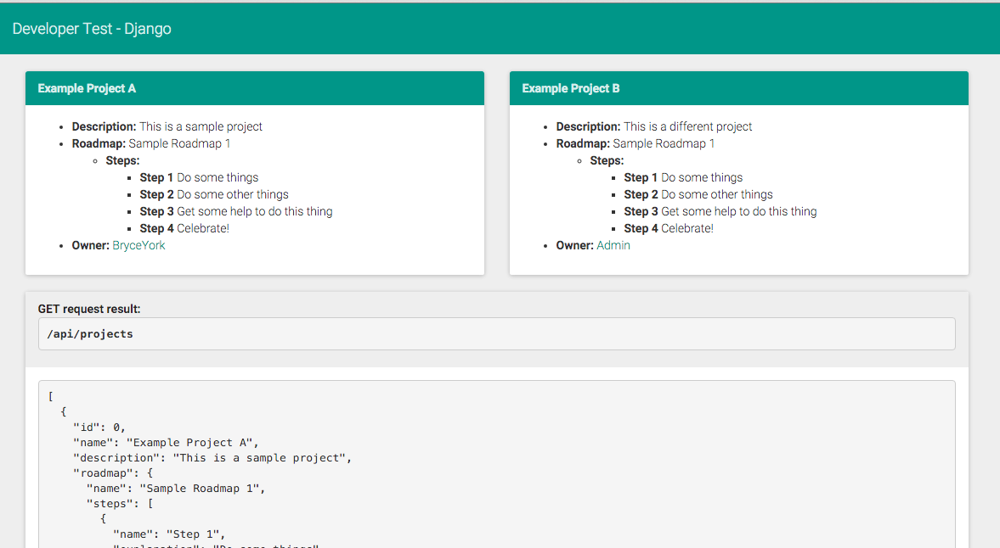

#Demo Project Briefing

##Overview
We've setup a basic django project that we would like you to add some functionality to.

The project has the required config files to run it using Docker. 

We've also used sql lite so you can easily share your demo data when you submit your pull request.

We would like to get an idea of how you manage your git workflow, so please make commits as you would if this were a standard project. However, to keep things simple please do everything on the master branch.

Superuser username `admin`, password `admin`.


##Requirements
We would like you to create some functionality within the roadmap app.

We would like to have 3 models: Projects, Roadmaps, and Steps.

We would like to have the information stored in the system available via a get request at an API.

###API
- The API should be made using [Django Rest Framework](http://www.django-rest-framework.org/)
- The API should be accessed via `/api/`
- GET requesting a Project object via the API should:
    - present a json representation of all the child data
    - return all of the attributes of the Roadmap and Step objects that are associated with the requested Project
    - return the username and email addresss of the Roadmap Owner (User object) which you'll need to add in the admin
- The JSON returned by a project should look like the example given below

###Relationships
- Each Project has one Roadmap
- Each Roadmap can belong to any number of Projects
- Each Project has an owner which is a User (a standard django user)
- Each Roadmap has a series of Steps that the user will go through in order
- Each Step can be in any number of Roadmaps

###Attributes
- **Project**
    - id
    - Name
    - Description (a simple one line description of project)
    - Roadmap
    - Owner
- **Roadmap**
    - id
    - Name
    - Steps
- **Step**
    - id
    - Name
    - Explanation (a plain-text explanation of how to complete the step)

##Testing
Once the API is setup, it will render a simple HTML representation of the data when the user visits the homepage of the project.


##Sample Data
### Output


- **Example Project A**
  - **Description:** This is a sample project
  - **Roadmap:** Sample Roadmap 1
      - **Steps:**
          - Step 1: Do some things
          - Step 2: Do some other things
          - Step 3: Get some help to do this thing
          - Step 4: Celebrate!
  - **Owner:** [BryceYork](mailto:byork@fusionlabs.com.au)
- **Example Project B**
  - **Description:** This is a different project
  - **Roadmap:** Sample Roadmap 1
      - **Steps:**
          - Step 1: Do some things
          - Step 2: Do some other things
          - Step 3: Get some help to do this thing
          - Step 4: Celebrate!
  - **Owner:** [Admin](mailto:admin@fusionlabs.com.au)

### JSON
**Full length available in static/data.json**
```javascript
[
  {
    "id": 0,
    "name": "Example Project A",
    "description": "This is a sample project",
    "roadmap": {
      "name":"Sample Roadmap 1",
      "steps": [
        {
          "name": "Step 1",
          "explanation": "Do some things"
        },
        {
          "name": "Step 2",
          "explanation": "Do some other things"
        },
        {
          "name": "Step 3",
          "explanation": "Get some help to do this thing"
        },
        {
          "name": "Step 4",
          "explanation": "Celebrate!"
        }
      ]
    },
    "owner": {
      "username": "BryceYork",
      "email": "byork@fusionlabs.com.au"
    }
  }
]
```

##Submission
Please submit your work via a pull request on this repo.